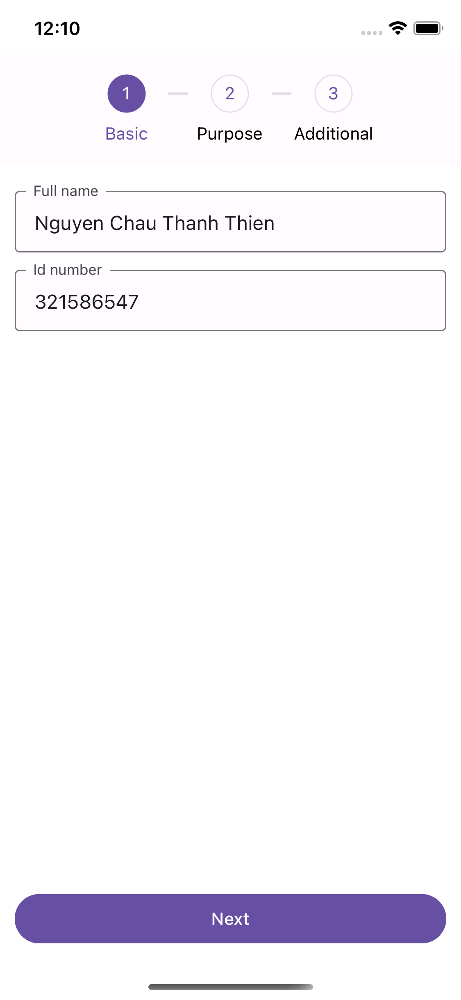
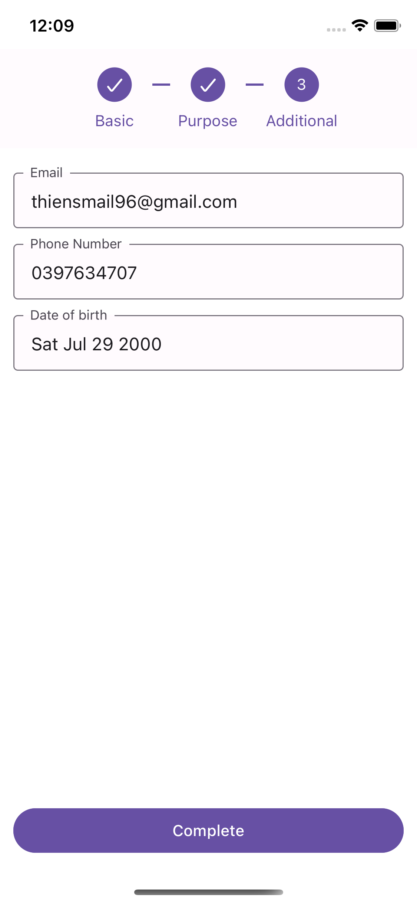
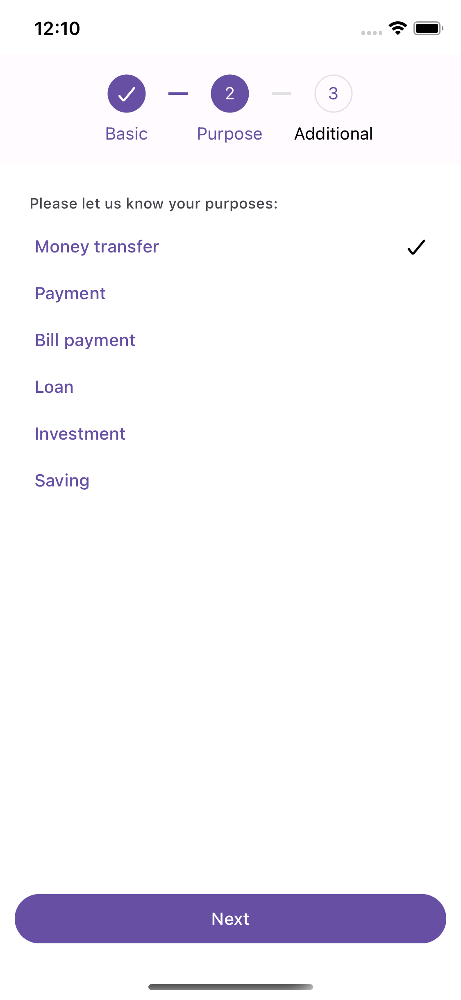
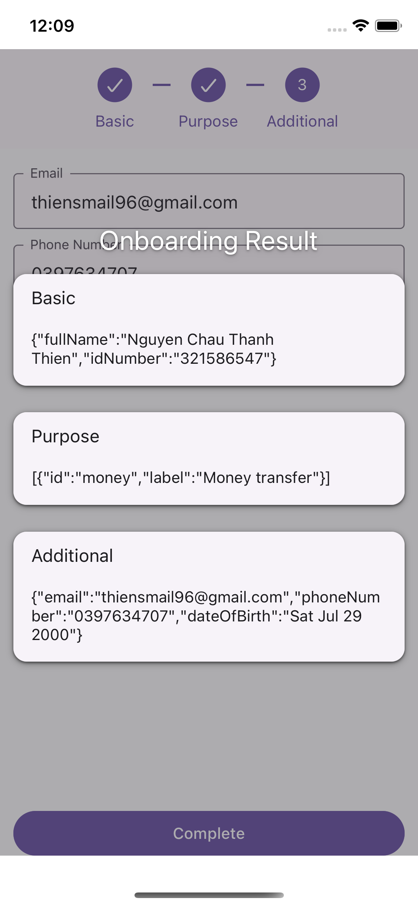

# SimpleOnboarding - BlueBik assigment

<table>
  <tr>
     <td>Basic</td>
     <td>Additional</td>
     <td>Purpose</td>
     <td>Result</td>
  </tr>
  <tr>
    <td></td>
    <td></td>
    <td></td>
    <td></td>
  </tr>
 </table>

## Features checklist

- [x] Gather user information from 3 onboarding steps.
- [x] Basic information: Full name(required), Id Number(required, Vietnamese Id format).
- [x] Additional information: Email(required, email format), Phone Number(required, Vietnamese phone number format); Date Of Birth(required, at least 18 year old).
- [x] Purpose: List of purpose of new account (choose at least 1 option).
- [x] Order of the onboarding flow should be configurable. Change `config.ts` file.
- [x] Three onboarding steps have been written with fully component testing.

## How to start the app

1. `yarn install`
2. `cd ios && pod install`
3. At the root folder: `yarn ios` or `yarn android`

## How to run unit testing

`yarn test`

## Behind the scene

This project has been built with:

- Typescript
- React, React Native
- React Native Paper (Theme & Component)
- React Hook Form (Each onboarding step state management)
- React Context (Global State for onboarding model)
- React Native Testing Library (Component / Unit Testing)

## Caveat

- Due to the lack of time, I decide to use **React Native Paper** for fast development.
- Due to the purpose of assignment, many components and the app have not been optimized performance yet.
